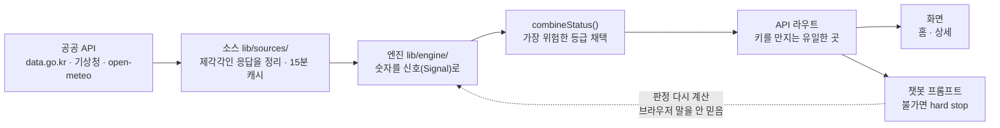

# CLAUDE.ko.md

영문 [CLAUDE.md](CLAUDE.md)를 쉽게 풀어 쓴 버전입니다. **사람이 읽는 참고용**이고, Claude Code가 자동으로 읽는 건 영문 쪽입니다.

## 이 앱이 하는 일

"지금 이 해변에서 물놀이해도 되나?", "지금 갯벌 들어가도 되나?"에 답해 주는 웹 앱입니다.

정부·공공기관이 공개한 바다 데이터(파고, 수온, 기상특보, 이안류, 조석 등)를 모아서 **가능 / 주의 / 불가** 세 가지로 알려 줍니다. 데이터를 못 가져왔을 땐 억지로 판정하지 않고 `데이터없음` 또는 `점검중`으로 표시합니다.

화면 문구도 코드 주석도 전부 한국어입니다. 새로 코드를 쓸 때도 한국어로 맞춰 주세요.

## 자주 쓰는 명령어

```bash
npm run dev              # 개발 서버 켜기 → http://localhost:3000
npm run build            # 배포용 빌드 (에러 없나 확인용으로도 씀)
npm run lint             # 코드 스타일 검사 (eslint)
npm run typecheck        # 타입 오류 검사
npm run verify:links     # 문서에 적힌 파일 경로가 실제로 있는지
```

위 네 개는 **키가 없어도 돌아가서** GitHub Actions가 push·PR마다 자동으로 검사합니다
([.github/workflows/ci.yml](.github/workflows/ci.yml)). 로컬에서 미리 돌려 보면
CI에서 빨개지는 걸 피할 수 있습니다.

검증용 스크립트 3개:

```bash
npm run verify:sources   # 외부 API 8개가 실제로 응답하는지 확인
npm run verify:verdict   # 등록된 모든 지점의 판정이 제대로 나오는지 확인
npm run verify:chat      # 챗봇이 위험한 답을 못 하게 막혀 있는지 확인
```

이 프로젝트엔 흔히 말하는 **유닛 테스트가 없습니다.** 위 세 개가 테스트 역할을 합니다. 진짜 API를 호출하기 때문에 `.env`에 키가 들어 있어야 돌아갑니다.

키가 필요해서 **CI에는 못 넣습니다.** 대신 로컬에서 돌리고 PR 본문에 결과를 붙이는 방식으로 남겼습니다(PR 템플릿에 체크리스트가 있습니다).

언제 뭘 돌리면 되는지:

| 고친 곳 | 돌릴 것 |
|---|---|
| [lib/engine/](lib/engine/) 또는 [lib/sources/](lib/sources/) | `verify:verdict` |
| [lib/chat/prompt.ts](lib/chat/prompt.ts) | `verify:chat` |
| 외부 API가 죽은 것 같을 때 | `verify:sources` |

### 환경변수

`.env` 파일에 넣습니다(깃에 안 올라가게 막혀 있음). 예시는 [.env.example](.env.example).

- `ANTHROPIC_API_KEY` — 챗봇용 (필수)
- `DATA_GO_KR_SERVICE_KEY` — 공공데이터포털 키. **바다 데이터 대부분이 이거 하나로 돌아갑니다** (필수)
- `KHOA_OPENAPI_KEY` — 예시 파일에 설명은 있지만 **실제로는 안 씁니다.** 지수 API도 결국 data.go.kr 키로 인증하므로 헷갈리지 마세요.

## 코드가 어떻게 흘러가나

데이터는 한 방향으로만 흐릅니다:



역방향 의존은 없습니다. 소스는 엔진을 모르고, 엔진은 화면·챗봇을 모릅니다.
점선 화살표 하나만 예외인데, 이건 의도한 것입니다 — 챗봇은 브라우저가 보낸 판정을
믿지 않고 서버에서 다시 계산합니다.

**1) 소스 — [lib/sources/](lib/sources/)**
외부 API 하나당 파일 하나. 제각각인 응답을 우리가 쓰기 좋은 모양으로 정리해서 넘깁니다.
공통 fetch는 [http.ts](lib/sources/http.ts)에 있는데, 여기 두 가지 장치가 있습니다:
- 응답을 **일단 텍스트로 받고 나서** JSON 파싱을 시도합니다. `type=json`을 붙여도 data.go.kr이 오류일 땐 XML을 뱉기 때문입니다.
- 15분(900초) 캐시를 걸어 둡니다. 공공 API 호출 횟수 제한에 걸리지 않으려고요.

주의: 응답 껍데기가 API마다 다릅니다. 조석은 `body`가 맨 위에 있고, 기상특보는 `response.body` 안에 들어 있습니다.

**2) 엔진 — [lib/engine/](lib/engine/)**
소스가 가져온 숫자를 "이건 가능, 저건 주의" 같은 신호(`Signal`)로 바꿉니다.
- [swim.ts](lib/engine/swim.ts) — 물놀이 판정
- [mudflat.ts](lib/engine/mudflat.ts) — 갯벌 판정
- [index.ts](lib/engine/index.ts) — 활동에 따라 위 둘 중 하나로 보내는 갈림길
- [types.ts](lib/engine/types.ts) — 공통 타입과 `combineStatus`(신호들을 하나의 최종 판정으로 합치는 함수)

**3) API 라우트 — [app/api/verdict/route.ts](app/api/verdict/route.ts), [app/api/chat/route.ts](app/api/chat/route.ts)**
외부 API와 API 키를 만지는 **유일한 곳**입니다. 브라우저에서 도는 코드는 절대 직접 외부를 호출하지 않습니다(키가 새니까요).

**4) 화면**
- [app/page.tsx](app/page.tsx) — 홈. 검색하고 판정 카드 보여 줌
- [app/place/[id]/page.tsx](app/place/[id]/page.tsx) — 상세. 시간대별 타임라인과 물때 곡선

## 절대 깨면 안 되는 규칙 4가지

**① 애매하면 위험한 쪽으로**
`combineStatus`는 신호 여러 개 중 **가장 위험한 등급**을 최종 판정으로 씁니다. 파고는 괜찮아도 이안류가 위험하면 전체가 위험입니다. 그리고 데이터가 없으면(`데이터없음`/`점검중`) 그 신호는 판정에서 빼 버립니다 — **빈 칸을 추측으로 메우지 마세요.** 틀린 "가능"은 사람이 다칩니다.

**② 지점은 데이터가 완비된 곳만**
[data/stations.ts](data/stations.ts)에는 그 활동에 필요한 신호가 **전부** 실제로 나오는 지점만 넣습니다. 하나라도 빠지면 "부분 지원"이 아니라 아예 제외입니다. 예를 들어 다대포는 해수욕지수는 있는데 이안류가 없어서 빠져 있습니다.
→ 지점을 추가하려면 소스를 하나씩 실제로 호출해 확인하고 `verify:verdict`를 다시 돌리세요.

**③ 챗봇이 판정을 뒤집지 못하게**
`/api/chat`은 브라우저가 보낸 판정 결과를 **믿지 않습니다.** 지점과 활동만 받아서 서버에서 `evaluate()`를 다시 계산합니다. 게다가 판정이 `불가`면 [buildSystemPrompt](lib/chat/prompt.ts)가 "무슨 일이 있어도 안전하다고 말하지 말라"는 문구를 프롬프트에 넣습니다. 사용자가 "그래도 괜찮지 않아?"로 구슬려도 넘어가지 않게 하는 장치이니 둘 다 유지하세요.

**④ 키는 서버 밖으로 나가지 않게**
`ANTHROPIC_API_KEY`, `DATA_GO_KR_SERVICE_KEY`는 API 라우트와 `lib/sources`/`lib/claude` 안에서만 읽습니다.

## 알아두면 시간 아끼는 것들

- **조석 `extrSe`는 숫자 코드입니다.** 홀수(1, 3) = 고조(만조), 짝수(2, 4) = 저조(간조). 문자열인 줄 알고 비교하면 조용히 틀립니다.
- **갯벌 안전창**은 간조 앞뒤 3시간, 끝나기 60분 전부터 복귀 경고([mudflat.ts](lib/engine/mudflat.ts)).
- **파고 기준**은 0.5m 미만 가능 / 1.0m 이하 주의 / 그 이상 불가([swim.ts](lib/engine/swim.ts)).
  ⚠️ 위 두 기준은 **아직 공식 안전기준으로 검증하지 않은 초안**입니다. 해수부 갯벌 가이드 등으로 확인이 필요합니다.
  → 누가 왜 이 숫자로 정했고 무엇을 확인해야 하는지는 [docs/adr/](docs/adr/)에 적어 뒀습니다
  ([파고·수온](docs/adr/0001-swim-wave-thresholds.md), [갯벌 안전창](docs/adr/0002-mudflat-safety-window.md)).
  **숫자를 바꾸면 해당 ADR도 같이 고치세요.**
- **지수 API는 한 번에 300행까지** 줍니다. 해수욕지수는 500행쯤 되므로 [oceanIndex.ts](lib/sources/oceanIndex.ts)에서 나눠서 가져옵니다.
- **시간은 전부 한국 시간(Asia/Seoul)** 기준입니다(`nowSeoulISO`, `todaySeoul`). 서버 로컬 시간을 그냥 쓰면 배포 환경에서 어긋납니다.
- 챗봇 모델은 [lib/claude.ts](lib/claude.ts)에 고정: 기본 `claude-haiku-4-5`(빠르고 쌈), 품질이 필요하면 `claude-sonnet-5`.

## 문서 어디에 뭐가 있나

- [docs/progress.md](docs/progress.md) — **여기부터 읽으세요.** 어디까지 했고 다음에 뭘 할지 적힌 인수인계 노트. 작업 끝나면 갱신.
- [docs/verified-apis.md](docs/verified-apis.md) — 실제로 호출해서 확인한 엔드포인트 주소, 지점 코드, 응답 모양. 소스 파일 고치기 전에 먼저 확인.
- [docs/implementation-plan.md](docs/implementation-plan.md) — 초기 구현 계획.
- [docs/adr/](docs/adr/) — **왜 이 숫자인가**를 적어 둔 곳. 파고 0.5m, 간조 ±3시간 같은 값의 근거와 아직 확인 못 한 것들. 임계값 건드리기 전에 읽으세요.

코드 옆에도 문서가 있습니다:

- [lib/CLAUDE.md](lib/CLAUDE.md) — 소스→엔진 계층, `http.ts` 규약, 새 소스·새 활동 추가 절차
- [app/CLAUDE.md](app/CLAUDE.md) — 라우트 지도, 서버 경계, 컴포넌트가 왜 `app/` 밑이 아니라 [components/](components/)에 있는지
