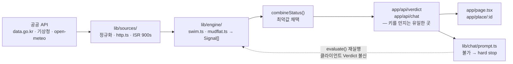

# CLAUDE.md

This file provides guidance to Claude Code (claude.ai/code) when working with code in this repository.

## Project

**오늘의 바다** — a Next.js 15 (App Router) app that judges whether swimming (`swim`) or mudflat walking (`mudflat`) is safe right now at Korean coastal sites, using official public data. Verdicts are one of `가능` / `주의` / `불가`, plus `데이터없음` / `점검중` for missing or degraded data. UI text and code comments are Korean; keep that convention.

## Commands

```bash
npm run dev              # http://localhost:3000
npm run build            # production build
npm run lint             # eslint (flat config, eslint.config.mjs)
npm run typecheck        # tsc --noEmit
npm run verify:links     # assert every local markdown link resolves

npm run verify:sources   # live-call all 8 external sources
npm run verify:verdict   # run evaluate() over every whitelisted station+activity
npm run verify:chat      # assert chat system prompt safety guards + /api/chat 400s
```

CI ([.github/workflows/ci.yml](.github/workflows/ci.yml)) runs the first block — `lint`,
`typecheck`, `verify:links`, `build` — on every push and PR. All four work without secrets;
API routes are dynamic, so `build` never reads a key.

There is no unit-test framework. The three `verify:*` scripts in [scripts/](scripts/) are the test suite; they hit real APIs and require a populated `.env`, so they are **not** in CI — run them locally and paste the output into the PR. They run TS directly via `node --env-file=.env --import tsx`. Run `verify:verdict` after touching anything in [lib/engine/](lib/engine/) or [lib/sources/](lib/sources/), and `verify:chat` after touching [lib/chat/prompt.ts](lib/chat/prompt.ts).

Required env (`.env`, gitignored — see [.env.example](.env.example)): `ANTHROPIC_API_KEY`, `DATA_GO_KR_SERVICE_KEY`. `KHOA_OPENAPI_KEY` is documented but unused — the index APIs authenticate with the data.go.kr key.

## Architecture

Data flows one way: **sources → engine → verdict → UI/chat**.



There is no reverse dependency: `sources/` does not know `engine/`, and `engine/` does not
know `chat/` or the UI. The one loop back is deliberate — `/api/chat` re-runs `evaluate()`
rather than trusting the `Verdict` the client posted.

- [lib/sources/](lib/sources/) — one module per external API, each returning normalized plain data. [http.ts](lib/sources/http.ts) is the shared fetch: it reads the body as text before parsing JSON (data.go.kr returns error XML even with `type=json`) and sets `next.revalidate` (default 900s) so Next ISR shields the public APIs from traffic. Response shapes differ per source — tide returns `body` at top level, weather warnings nest under `response.body`.
- [lib/engine/](lib/engine/) — [swim.ts](lib/engine/swim.ts) and [mudflat.ts](lib/engine/mudflat.ts) turn source data into `Signal[]`, and [index.ts](lib/engine/index.ts) routes by activity. [types.ts](lib/engine/types.ts) holds `Verdict`/`Signal`/`Status` and `combineStatus`.
- [app/api/verdict/route.ts](app/api/verdict/route.ts) and [app/api/chat/route.ts](app/api/chat/route.ts) — the only places external APIs and API keys are touched. Client components never call outward directly.
- [app/page.tsx](app/page.tsx) (home: search + verdict card) and [app/place/[id]/page.tsx](app/place/[id]/page.tsx) (detail: timeline + tide curve) consume `Verdict` from the API.

### Invariants to preserve

- **Conservative combination.** `combineStatus` takes the worst of the three-color signals. `데이터없음`/`점검중` are excluded from the verdict rather than guessed at — never fabricate a status to fill a gap.
- **Station whitelist.** [data/stations.ts](data/stations.ts) only lists sites where *every* signal that activity needs resolves to real data. A site missing one signal (e.g. Dadaepo has no rip-current index) is excluded, not partially supported. Adding a station means verifying each source live and rerunning `verify:verdict`.
- **Chat cannot overturn the verdict.** `/api/chat` re-runs `evaluate()` server-side from the client's station/activity rather than trusting the posted `Verdict`, and [buildSystemPrompt](lib/chat/prompt.ts) injects a hard stop when status is `불가`. Keep both.
- **Keys stay server-side.** `ANTHROPIC_API_KEY` and `DATA_GO_KR_SERVICE_KEY` are read only inside route handlers and `lib/sources`/`lib/claude`.

### Domain gotchas

- Tide `extrSe` is a numeric code: odd (1, 3) = high tide (만조), even (2, 4) = low tide (간조).
- Mudflat safety window is low tide ±3h with a return warning 60 min before it closes ([mudflat.ts](lib/engine/mudflat.ts)). Wave thresholds are `<0.5m` 가능 / `≤1.0m` 주의 / else 불가 ([swim.ts](lib/engine/swim.ts)). Both are drafts pending validation against official safety standards — the reasoning and the open verification items live in [docs/adr/](docs/adr/) ([0001](docs/adr/0001-swim-wave-thresholds.md), [0002](docs/adr/0002-mudflat-safety-window.md)). Changing a threshold means updating its ADR.
- Index APIs cap `numOfRows` at 300; the beach index has ~500 rows and paginates in [oceanIndex.ts](lib/sources/oceanIndex.ts).
- All time handling is Asia/Seoul (`nowSeoulISO`, `todaySeoul`); don't fall back to server-local time.

Claude models are pinned in [lib/claude.ts](lib/claude.ts) (`claude-haiku-4-5` default, `claude-sonnet-5` for quality).

## Docs

Module-scoped guides sit next to the code: [lib/CLAUDE.md](lib/CLAUDE.md) (source→engine
layering, http.ts contract, how to add a source or activity) and
[app/CLAUDE.md](app/CLAUDE.md) (route map, the server boundary, why components live in
[components/](components/) rather than under `app/`).

[docs/adr/](docs/adr/) records *why* a threshold is what it is — the numbers that decide
`가능`/`주의`/`불가` are life-safety values and are still unvalidated drafts. Read the
relevant ADR before touching one.

[docs/progress.md](docs/progress.md) is the running handoff log (milestones, verification state, next steps) — update it after substantive work. [docs/verified-apis.md](docs/verified-apis.md) records live-verified endpoints, station codes, and response schemas; consult it before changing a source client.
